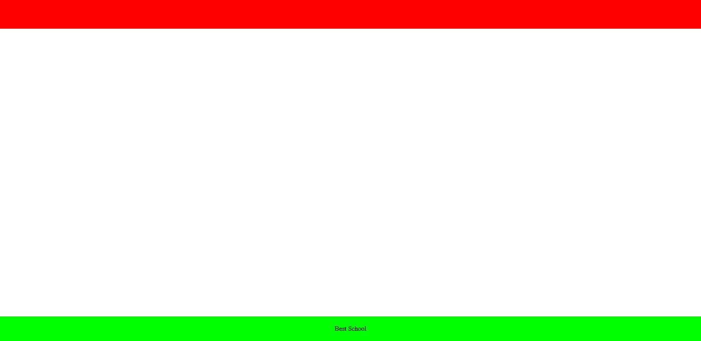
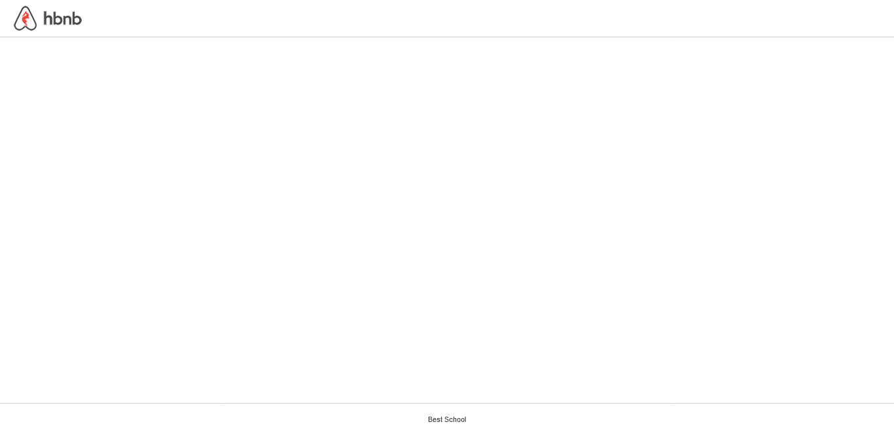
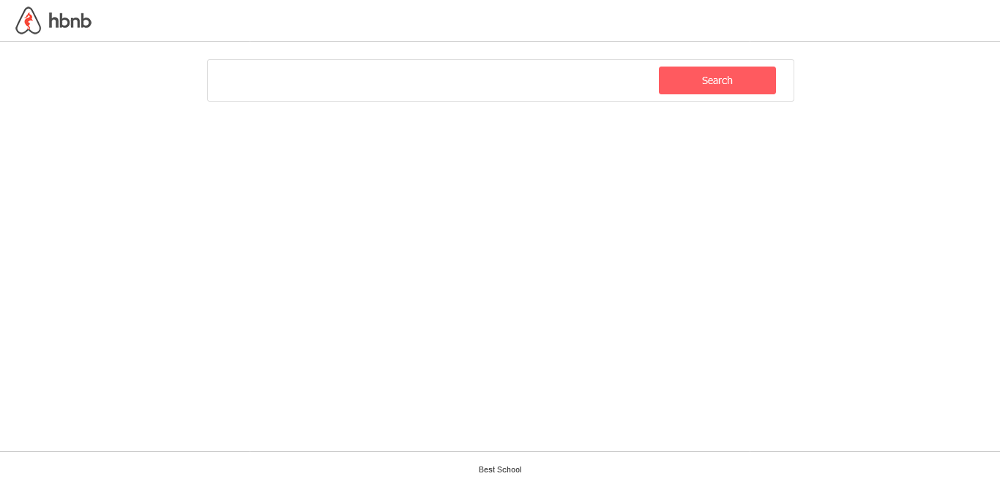
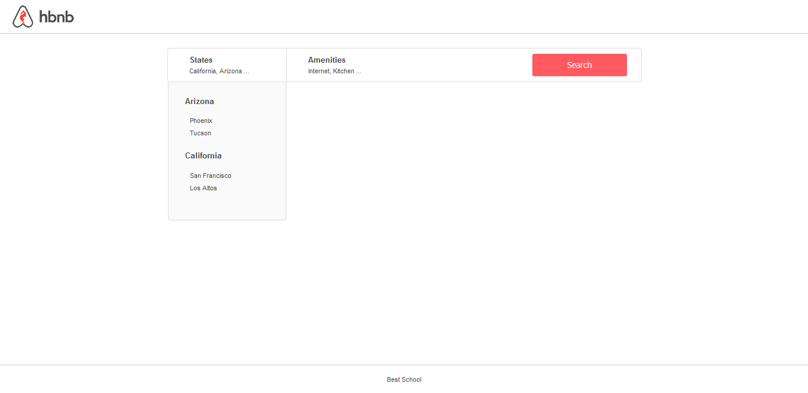
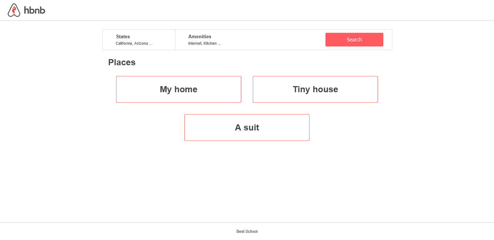
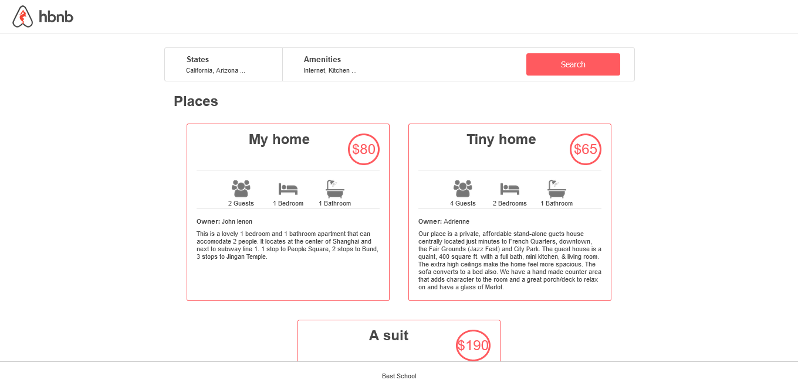
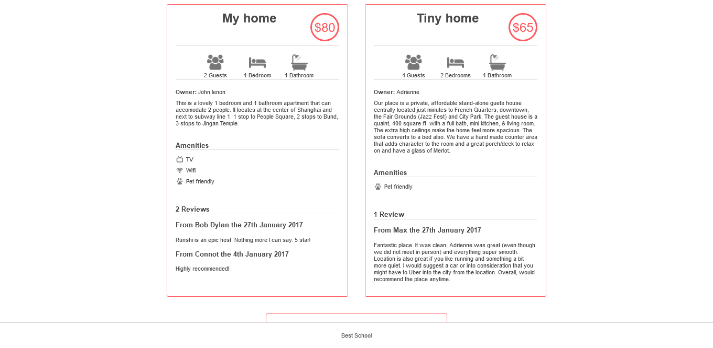
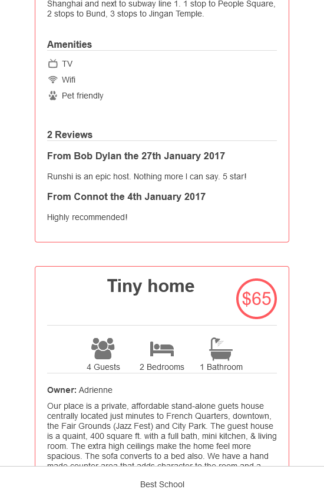
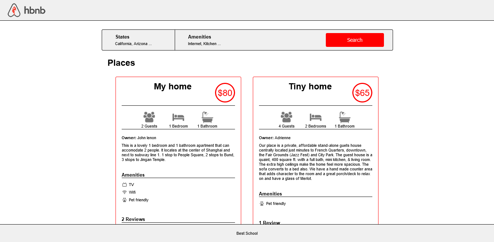

# AirBnB clone - Web Static

This directory contains the web static files for the AirBnB clone project.
The AirBnB clone is a project to recreate some parts of the Airbnb platform.
The web static files are the HTML, and CSS files that are served to users when they visit the website.

## Screenshots

### [0-index.html](0-index.html), [1-index.html](1-index.html), [2-index.html](2-index.html)

A page that displays a header and a footer once by using inline CSS, once by using internal CSS, and once using external CSS.

### [3-index.html](3-index.html)

A page that displays a header and footer by using CSS files.

### [4-index.html](4-index.html)

A page that displays a header, footer and a filters box with a search button.

### [5-index.html](5-index.html)

A page that displays a header, footer and a filters box.

### [6-index.html](6-index.html)

A page that displays a header, footer and a filters box with dropdown.

### [7-index.html](7-index.html)

A page that displays a header, footer, a filters box with dropdown and results.

### [8-index.html](8-index.html)

A page that displays a header, a footer, a filter box (dropdown list) and the result of the search.

### [100-index.html](100-index.html)

Same page as _[8-index.html](8-index.html)_ (with added information to the Place articles).

### [101-index.html](101-index.html)

Same page as _[8-index.html](8-index.html)_ (with improved Places section by using Flexible boxes for all Place articles).

### [102-index.html](102-index.html)

Same page as _[8-index.html](8-index.html)_ (with improved responsive design to display correctly in mobile or small screens).

### [103-index.html](103-index.html)

Same page as _[8-index.html](8-index.html)_ (with improved design by addingdesign Accessibility support).

