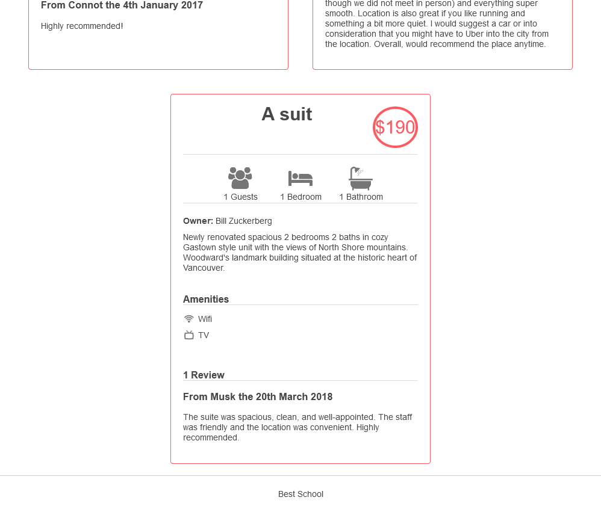

# AirBnB clone - Web Static

This directory contains the web static files for the AirBnB clone project.
The AirBnB clone is a project to recreate some parts of the Airbnb platform.
The web static files are the HTML, and CSS files that are served to users when they visit the website.

## Screenshots

### [0-index.html](0-index.html), [1-index.html](1-index.html), [2-index.html](2-index.html)

### [3-index.html](3-index.html)

### [4-index.html](4-index.html)

### [5-index.html](5-index.html)

### [6-index.html](6-index.html)

### [7-index.html](7-index.html)

### [8-index.html](8-index.html)

### [100-index.html](100-index.html)

### [101-index.html](101-index.html)

### [102-index.html](102-index.html)

### [103-index.html](103-index.html)

